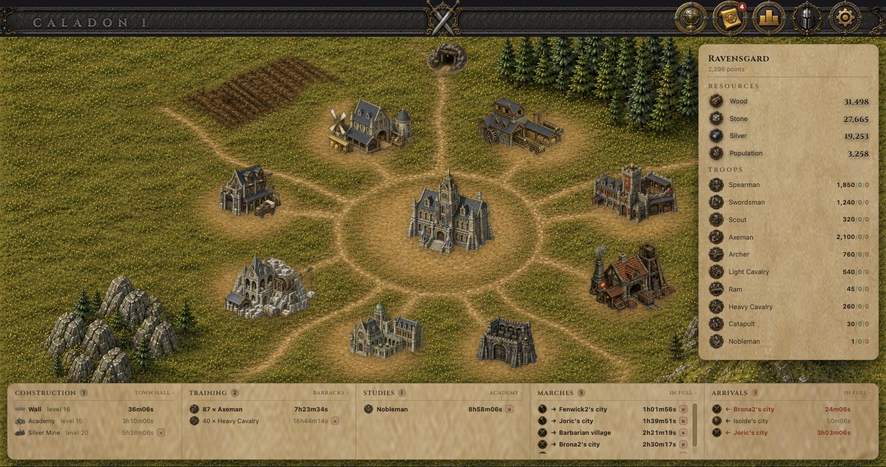
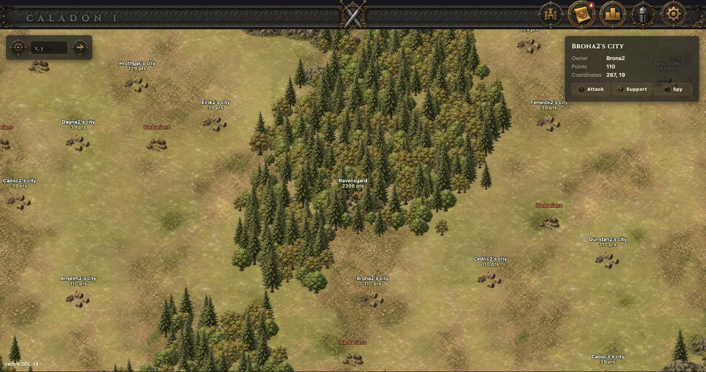
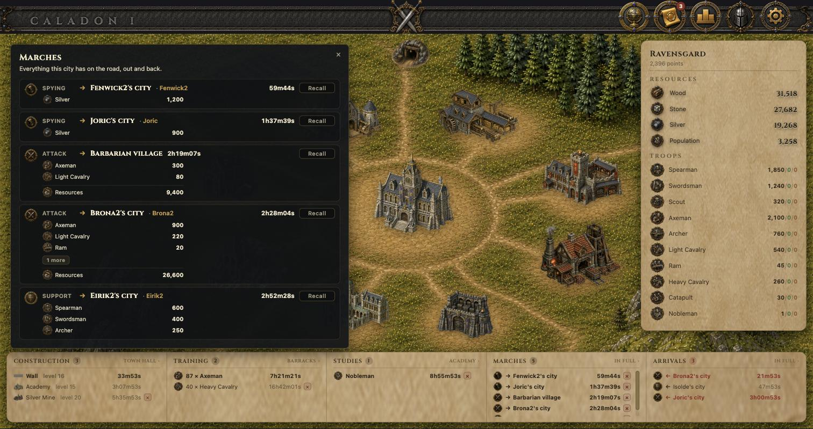
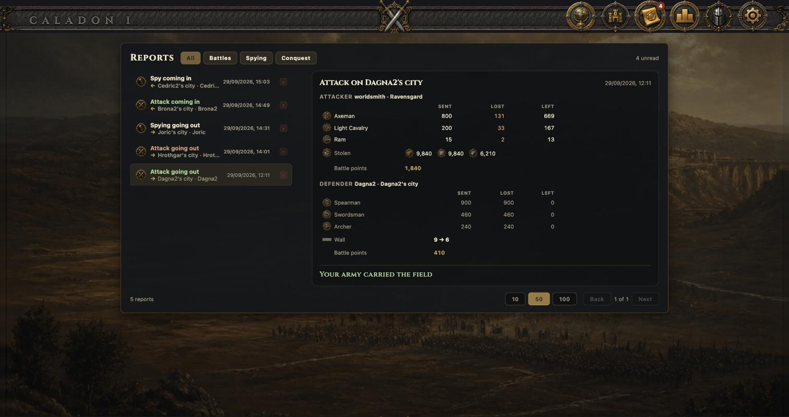
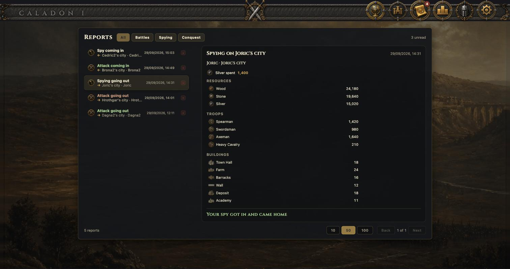
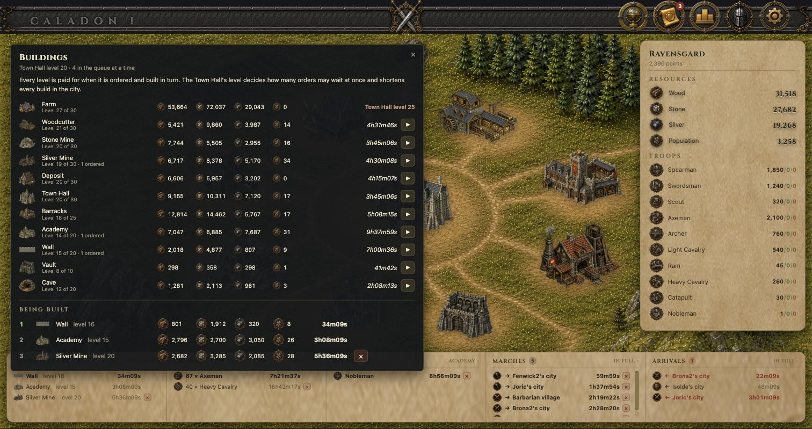
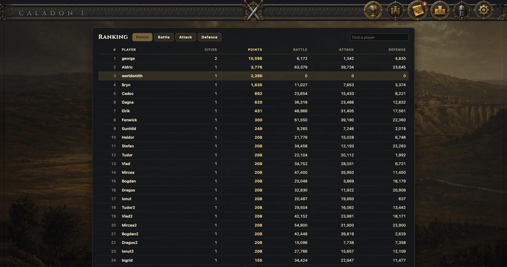

# Caladon

A browser strategy MMO. You are given one city on a shared map, and what you do with it is build it up,
raise an army, and take your neighbours' cities off them. See [ARCHITECTURE.md](ARCHITECTURE.md) for the
design decisions behind everything below.

## What it looks like

The city. Eleven buildings on their plots, the panel with what the city holds, and along the bottom
everything it has going: what is being built, trained and studied, and what is on the road both ways.



The map, and what may be sent at a field you pick on it.



What the city has on the road — every march in full, with what it carries and how long it has left,
each one recallable until it lands.



A battle report: what was sent, what died, what came home, what was taken, and the Wall the rams left
behind.



A spy who got in, and what the silver bought.



Every building's next level, what it costs, and what is blocking the ones that are blocked.



The standings, by city points or by the population a player has killed attacking and defending.



## How it plays

### A city is eleven buildings

Every city has the same eleven, and every one of them is a ladder. A level costs
`base × factor^(level−1)` of wood, stone and silver, takes a population to staff, and is worth points —
the Tribal Wars curve, `P1 × 1.2^(L−1)`. **A city's points are the points of its buildings, and a
player's points are the points of their cities.** Nothing else counts.

Six exist from the moment the city is founded: **Farm**, **Woodcutter**, **Stone Mine**, **Silver Mine**,
**Deposit** and **Town Hall**. The other five are built when the Town Hall is high enough: **Barracks**,
**Academy**, **Wall**, **Vault** and **Cave**.

Each does one thing, and the whole economy falls out of them:

- The **Farm** is the only source of people. Everything else — buildings and troops alike — is paid for
  out of it, which is what stops a city being all army.
- The three producers make wood, stone and silver by the hour; the **Deposit** caps how much can be
  held, and anything made over that is lost.
- The **Town Hall** speeds up building, lengthens the build queue, and gates how far everything else may
  be raised.
- The **Wall** multiplies the defence of everyone standing in the city.
- The **Vault** hides resources an attacker cannot take.
- The **Cave** holds silver out of sight — it pays for your spying and is what another player's spies
  must outbid to learn anything about you.

### Nothing is scheduled

There is no job ticking away at your city. An order carries the instant it completes, and the city is
brought up to date the next time anybody looks at it — you, or an arriving army, or a sweeper that
catches whatever nobody has touched in a minute. A city you have not opened for a week is exactly as far
along as one you watched all week.

### An army, and what it costs

Ten unit types, trained in the **Barracks**. All but the Spearman must first be studied in the
**Academy**, which is one-off and permanent. Every unit eats population for as long as it lives, so an
army is a standing bill against the Farm rather than a one-time purchase.

Units differ in attack, in three separate defences (against infantry, cavalry and archers), in speed —
which sets how long a march takes, the slowest unit setting the pace — and in how much loot they carry.

### Battles

Tribal Wars' own arithmetic. The attacker's power is split across infantry, cavalry and archers by what
was actually sent; the defence is weighed against each arm in that proportion, and multiplied by the
Wall. The side with more power wins, **the loser is wiped out**, and the winner loses

```
(loser's power / winner's power) ^ 1.5
```

of itself. A close fight is ruinous to win; a rout is nearly free. The dead give their population back to
whichever city raised them — the attacker's to the attacker, each supporter's to that supporter.

Only **rams and catapults** batter the Wall, and only the Wall: two levels of siege strength take one
level off it. Whatever the survivors can carry, they take, less what the Vault hides.

### Sending troops somewhere

Three errands: **attack**, **support** and **spying**. Support stays in the city it was sent to and
defends it as if it were its own, while still belonging to the city that lent it. Anything on the road
can be recalled before it lands, and turns for home having flown as long as it already had.

Everything you have in the air is along the bottom of the city view, both ways: what you sent, what is
coming back, and what somebody is sending at you. An incoming attack does not show what is in it until
it is in the last quarter of its flight.

### Spying

There are no scouts. Spying is bought: you pay silver out of your **Cave**, and you learn what the
target holds if you outbid the silver in *theirs*. Outbid, and you see their stocks, their buildings and
their army; outbid by them, and you lose the silver and they get a report that someone tried. One
mission per target at a time.

### Barbarian villages

Unowned villages scattered over the map. They can only be attacked, never supported or spied. A fresh
one defends with 100 brigands; every time it is taken it hardens, to 200 and then 300, and if nobody
bothers it for a day it softens again.

They are not an infinite tap. A raid takes at most a fifth of what your own **Deposit** could hold, and
the village's store refills slowly — so raiding the same village all afternoon is not worth the marching.

### Conquest

A city is taken by **holding** it. No loyalty, no dice.

An attack that wins with a **Nobleman** still standing, and at least one man beside him, does not turn
around: it stays, and the city is held for **12 hours**. Anyone may break the hold in that time — the
owner from another of his cities, an ally, or a third party who wants the city for himself. A Nobleman
alone holds nothing; the moment he is the last one standing, the attempt is over.

A held city does nothing at all: no production, no building, no training, no studying, nothing sent. Its
queues are thrown away, and everything it had lent to other cities turns for home with one chance to
arrive and save it.

When the hold runs out the city changes hands with the garrison still in it. Everything of the old
owner's that was outside the walls is lost — armies on the road, troops lent elsewhere, the lot.

### Reports and standings

Every battle, raid and spy mission writes a report to each side, as a snapshot: what was sent, what
died, what came home, what was taken, what the Wall was left at. A beaten attacker learns nothing —
nobody came back to tell him.

Two things are counted for the standings. **Points** are the cities you hold. **Battle points** are the
population you have killed, kept apart as attack and defence, so the board can be read four ways.

## Modules

| module   | contents                                                                                     |
|----------|----------------------------------------------------------------------------------------------|
| `users`  | users, roles, JWT authentication (`/api/v1/auth/*`)                                          |
| `worlds` | world generation (terrain, city slots, barbarian villages), lifecycle, join, map viewport     |
| `app`    | the runnable Spring Boot application; depends on every feature module                        |
| `ui/`    | the single-page app (React + TypeScript + Vite); not a Maven module                          |
| `web/assets/` | procedural placeholder sprites (`procedural-sprites.js`) and a standalone `preview.html` |

Each feature module owns its Flyway migrations (`users`: V1–V99, `worlds`: V100–V199).

## Requirements

- JDK 17+, Maven 3.9+
- Docker (for the local PostgreSQL and for the integration tests)
- Node 22+ (see `ui/.nvmrc`) for the frontend

## Run locally

```bash
docker compose up -d          # PostgreSQL on localhost:5433 (db/user/password: caladon)
mvn package -DskipTests
java -jar app/target/app-0.1.0-SNAPSHOT.jar
```

Configuration (all optional for local development): `CALADON_DB_URL`, `CALADON_DB_USER`,
`CALADON_DB_PASSWORD`, `CALADON_JWT_SECRET` (at least 32 bytes; **must** be set outside local dev).

## A new world

```bash
scripts/new-world.sh "Caladon III"
```

Generating a world takes a moment: terrain, city slots and barbarian villages are all laid out before
it is opened for play. Only an administrator may do it, so the script keeps a development account of
its own, registered the first time it runs — see the top of the file.

## Honest points

A city's points are the points of its buildings, and a player's are the points of their cities. The
number on the city is a counter the game keeps as levels complete, so it is only ever as true as the
rows it was counted from — a city seeded straight into the database, or a level set by hand, puts it
out. This recounts every city, and gives a seeded city the buildings its points claimed.

```bash
PGPASSWORD=caladon psql -h localhost -p 5433 -U caladon -d caladon \
  -v ON_ERROR_STOP=1 -f scripts/honest-points.sql
```

## A city with everything

```bash
PGPASSWORD=caladon psql -h localhost -p 5433 -U caladon -d caladon \
  -v ON_ERROR_STOP=1 -v city=151 -f scripts/max-city.sql
```

Every building to the top of its own ladder, with the city's points, free population and stocks
recounted to match, for looking at a city that has everything.

## A world worth looking at

The screenshots above are of a seeded player: a city some months along, an army, something in every
queue, troops on the road in every direction, and a few reports to read.

```bash
PGPASSWORD=caladon psql -h localhost -p 5433 -U caladon -d caladon \
  -v ON_ERROR_STOP=1 -v player="'you@example.com'" -f scripts/demo.sql
```

It moves that player's first city into the thick of the map and fills it in. Everything it writes is
arithmetic the game itself would have produced — points from levels, population from the Farm less what
the buildings hold — so nothing in the screenshots is a number that could not happen.

## A known player state

Joining a second world from the lobby founds a city there and leaves you looking at an empty map with
nothing to play against. This puts the development player back: one world, two cities, everything else
undone.

```bash
PGPASSWORD=caladon psql -h localhost -p 5433 -U caladon -d caladon \
  -v ON_ERROR_STOP=1 -f scripts/dev-state.sql
```

Run it as often as you like — it only does what is missing, and refuses to remove a city elsewhere that
has been played in. The player, the world and the second city's name are the three `\set` lines at the
top of the file.

## Run the UI

```bash
cd ui
npm install
npm run dev        # http://localhost:5173, proxies /api to the backend on :8080
```

## Test

```bash
mvn test                 # backend
cd ui && npm test        # frontend unit tests (vitest)
cd ui && npm run build   # typecheck + production bundle in ui/dist
```

The API tests in `users` start a throwaway PostgreSQL via Testcontainers and are skipped when Docker
is not available.

## Administrators

Registration always creates a `PLAYER`. To get an administrator, promote an account directly in
the database:

```sql
UPDATE users SET role = 'ADMINISTRATOR' WHERE email = 'admin@example.com';
```

## Try the API

```bash
B=http://localhost:8080/api/v1/auth
curl -i -X POST $B/register -H 'Content-Type: application/json' \
  -d '{"email":"a@b.com","nickname":"george","password":"password1"}'
curl -s -X POST $B/login -H 'Content-Type: application/json' \
  -d '{"email":"a@b.com","password":"password1"}'
curl -s -X POST $B/refresh -H 'Content-Type: application/json' -d '{"refreshToken":"<jwt>"}'
curl -i -X POST $B/logout -H 'Authorization: Bearer <access jwt>' \
  -H 'Content-Type: application/json' -d '{"refreshToken":"<jwt>"}'

# worlds (W = http://localhost:8080/api/v1, T = an access token)
curl -s -X POST $W/admin/worlds -H "Authorization: Bearer $T" -H 'Content-Type: application/json' -d '{"name":"Caladon I"}'
curl -s -X POST $W/admin/worlds/1/approve -H "Authorization: Bearer $T"
curl -s $W/worlds -H "Authorization: Bearer $T"
curl -s -X POST $W/worlds/1/join -H "Authorization: Bearer $T"
curl -s "$W/worlds/1/map?startX=205&startY=205&endX=294&endY=294" -H "Authorization: Bearer $T"
curl -s $W/worlds/1/cities/mine -H "Authorization: Bearer $T"
curl -s $W/worlds/1/cities/99 -H "Authorization: Bearer $T"     # owner only: resources, population, buildings, queues, units

# city gameplay (C = $W/worlds/1/cities/99)
curl -s $C/buildings -H "Authorization: Bearer $T"                                 # levels + next level (cost, pop, time, blockedBy)
curl -s -X POST $C/buildings/WOODCUTTER/upgrade -H "Authorization: Bearer $T"       # order the next level (paid now, queued)
curl -s -X DELETE $C/build-orders/1 -H "Authorization: Bearer $T"                   # cancel + refund
curl -s $C/army -H "Authorization: Bearer $T"                                       # units, study status, what blocks recruiting
curl -s -X POST $C/army/study -H "Authorization: Bearer $T" -H 'Content-Type: application/json' -d '{"unit":"SWORDSMAN"}'
curl -s -X POST $C/army/recruit -H "Authorization: Bearer $T" -H 'Content-Type: application/json' -d '{"unit":"SPEARMAN","count":5}'
curl -s -X DELETE $C/recruit-orders/1 -H "Authorization: Bearer $T"                 # only the last order of a queue can be cancelled
curl -s -X DELETE $C/study-orders/SWORDSMAN -H "Authorization: Bearer $T"
```
